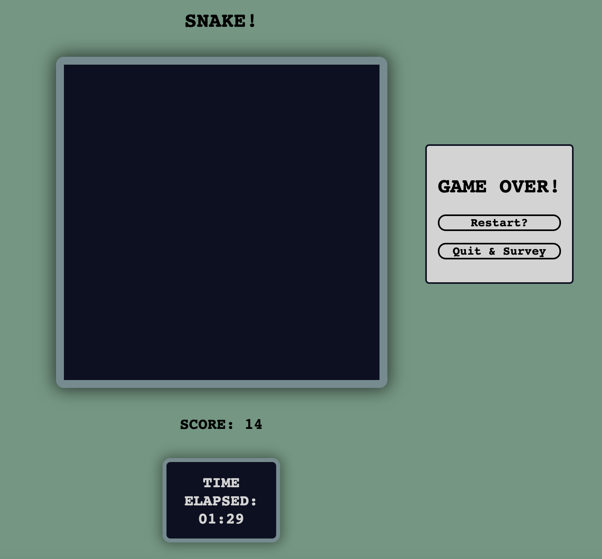

# Gaming/Media Addiction Experiment
Mari Dudek

## Description
For this project, I am exploring social media and gaming addiction. I will be exploring the connection between the length of time spent playing a simple game and the amount of time the participant spends on social media and games per week (answered in a post-experiment survey). The game played by participants will be something mindless and simple to play, and easy to restart if you lose. This way the participant can continue to play for as long as they want. I believe the best candidate for the game is Snake. Everyone likely already knows how the game is played.

## Experiment Design 
For the testing of my project, I will design a simple and easy to play game that will test addiction in human computer interaction. This game (Snake) will make it so that it will be easy to lose track of time while playing if the participant is one to normally lose track of time on games and social media. The participants will be allowed to play the game for as long as they choose and stop the game whenever they choose. When the length of play is up to the discretion of each participant, they are able to play the game with the same habits as their normal gaming habits. 
The independent variable in this experiment will be the stopwatch. Manipulation of the independent variable will not be any manipulation of the stopwatch itself, but manipulation of its visibility to the experiment participants. Half of the participants will have access to a visible stopwatch and be able to see how long they have been playing the game from start to finish. The other half of the participants will not be able to see how long they played the game at any time.

When each participant has finished playing, they will be presented with a post-experiment survey to answer questions about their normal gaming and social media habits. Some of these questions will include:
- What is your age?
- How many hours per week do you spend playing video games? [] 0-3  [] 4-6  [] 7-10  [] 11-14  [] 15+
- How many hours per week are you on social media? [] 0-3  [] 4-6  [] 7-10  [] 11-14  [] 11-14  [] 15+
- How many hours per day on average are you on your phone? (use your Screen Time Report in your phone settings to be most accurate) 

In analysis, the participant’s game playing times will be compared with their survey answers to determine if lifestyle gaming and social media habits were reflected in the game experiment. Additionally, the results of the independent stopwatch variable will be compared to determine if the ability to see their gameplaying time affected if participants stopped earlier on average.

## Participants 
I have not yet begun experiments. At this moment, my plan is for my participant study group to be made up of a wide range of ages, but mostly college students and/or teenagers. I will have around 30 participants, but hopefully more, and each participant will only do the experiment once (either with the visible timer, or with the hidden timer). 
